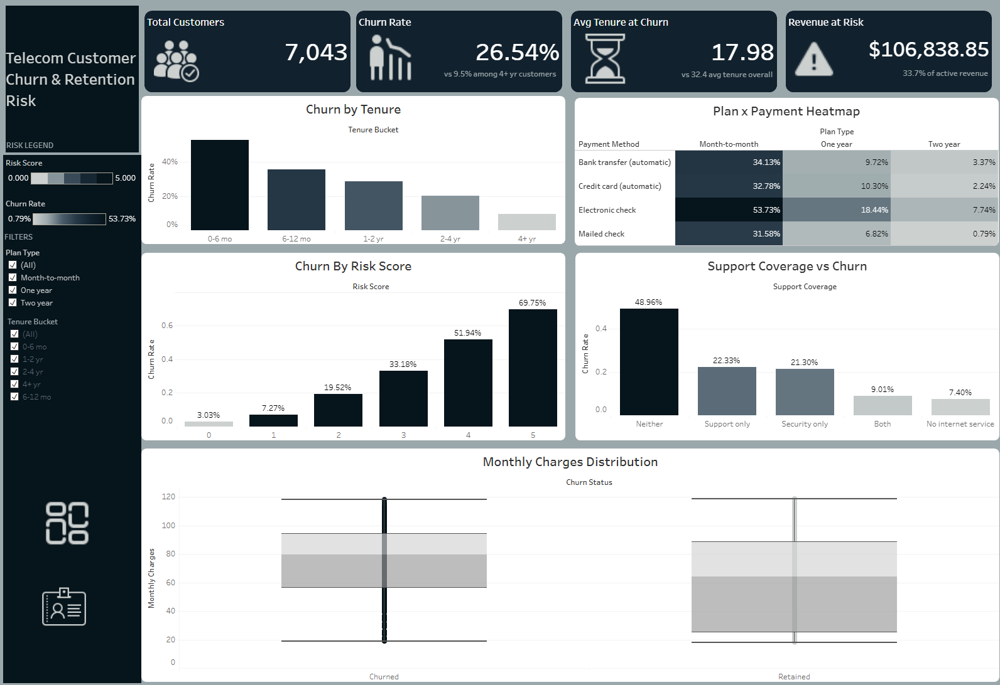
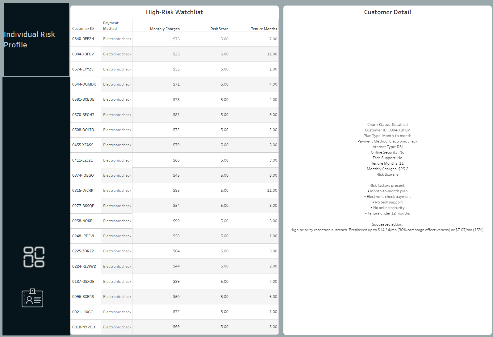
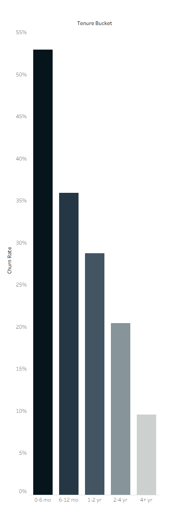

# Telecom Customer Churn & Retention Risk


A SQL-driven churn analysis and interactive Tableau dashboard built on a 7,043-customer telecom dataset. The goal wasn't just to report a churn rate — it was to answer three questions a retention team actually needs answered: **who** is most likely to leave, **when** they leave, and **what behavioral signals** show up early enough to act on before they do.

**[→ View the live dashboard](https://public.tableau.com/app/profile/cristian.garcia3939/viz/TelecomCustomerChurnDashboard_17875771165110/Overview?publish=yes)**

---

## Table of contents

- [Dataset](#dataset)
- [Screenshots](#screenshots)
- [Repository structure](#repository-structure)
- [Headline findings](#headline-findings)
- [Methodology](#methodology)
- [Risk score](#risk-score)
- [Revenue impact](#revenue-impact)
- [Recommendation](#should-you-run-a-retention-campaign)
- [SQL techniques demonstrated](#sql-techniques-demonstrated)
- [Limitations](#limitations)
- [Reproducing this project](#reproducing-this-project)
- [Tools](#tools)

---

## Dataset

[IBM Telco Customer Churn](https://www.kaggle.com/datasets/blastchar/telco-customer-churn), via Kaggle. 7,043 customers, a single quarterly snapshot — no date field, no churn-reason field. Every finding in this project is inferred from correlation and explicitly tested for confounding; none of it is confirmed against a labeled cause, and the write-up says so wherever that distinction matters.

## Screenshots

**Overview dashboard**


**Customer drill-down — click any row in the watchlist, get a full risk profile with the specific factors driving that customer's score**


**Churn by tenure — the single clearest finding in the dataset**


## Repository structure

```
telecom-churn-analysis/
├── README.md
├── telecom_churn_analysis.sql
└── screenshots/
    ├── 01_overview_dashboard.png
    ├── 02_customer_detail.png
    ├── 03_watchlist_closeup.png
    └── 04_churn_by_tenure.png
```

## Headline findings

| Metric | Value |
|---|---|
| Overall churn rate | **26.54%** |
| Churn, 0–6 month tenure | **52.9%** |
| Churn, 4+ year tenure | **9.5%** |
| Month-to-month contract churn | **42.7%** |
| Two-year contract churn | **2.8%** |
| No tech support + no security | **49.0%** churn |
| Both tech support and security | **9.0%** churn |
| Electronic check payment | **45.3%** churn (elevated at every contract tier) |

The tenure gap alone — a 5.5x difference between new and long-tenured customers — points at an onboarding and early-engagement problem, not a general satisfaction problem. That distinction shapes everything in the recommendation section below.

## Methodology

**Validation before analysis.** Checked for duplicate customer IDs, null values across every field used downstream, and out-of-range values (negative tenure, non-binary churn flags) before running a single segmentation query. All clean — zero duplicates, zero nulls, zero out-of-range rows.

**Confound testing, not just correlation.** Several findings only hold up once you rule out the obvious alternative explanation:

- *Is plan type just a proxy for "new customer"?* New signups default to month-to-month, so this needed checking. Holding tenure constant, month-to-month customers still churn at 26.0% even past 4 years — vs. 3.3% for two-year customers in the same tenure bracket. The effect is real and independent of tenure.
- *Is electronic check just a proxy for "low commitment"?* It correlates with month-to-month plans. Holding plan type constant, electronic check stays roughly 2x higher than every other payment method at every contract tier, including two-year. This points to payment friction (failed charges, no saved card) rather than pure self-selection.
- *Add-on count looked broken at first* — zero add-ons showed *lower* churn than one add-on, breaking an otherwise clean trend. Root cause: phone-only customers (no internet) were being counted as "zero add-ons" alongside genuinely disengaged internet subscribers, and phone-only customers have a much lower baseline churn rate on their own. Restricting the metric to internet subscribers produced a clean monotonic line: 52.2% churn at zero add-ons down to 5.3% at six.

**Checked, no material independent signal found:** gender, Partner, Dependents. Senior citizen status shows a real ~15-point bump in combination with paperless billing, but adds nothing beyond what tenure, plan type, and support coverage already explain.

**No synthetic data.** An earlier version of this project tested a randomly generated region field for geographic segmentation. The dataset has no real geography, so it was dropped rather than presented as a finding. Every dimension in the final analysis is a real column from the source data.

## Risk score

Five factors, each validated independently above, combined additively into a 0–5 score:

- Month-to-month plan
- Electronic check payment
- No tech support
- No online security
- Tenure ≤ 12 months

| Risk score | Churn rate |
|---|---|
| 0 | 3.0% |
| 1 | 7.3% |
| 2 | 19.5% |
| 3 | 33.2% |
| 4 | 51.9% |
| 5 | 69.8% |

A customer with all five factors present is roughly **23x** more likely to churn than one with none — and the climb is clean and monotonic, meaning the score genuinely ranks risk rather than just describing two lump groups. Implemented as a SQL view (`customer_risk`) so it's directly queryable rather than recalculated per-query.

## Revenue impact

Raw dollars sitting in a risk tier isn't the same as *expected* loss — a dollar at 3% churn probability and a dollar at 70% aren't equally at stake. Each tier's active revenue is weighted by its own churn rate to get an expected-loss figure:

**Total expected monthly revenue loss across the active customer base: ~$67,959**, with risk tiers 3–5 (1,525 active accounts) accounting for roughly **$48,000** of that on their own.

## Should you run a retention campaign?

A parameterized stored procedure (`breakeven_analysis`) takes a cost-per-account and an assumed campaign effectiveness rate, and returns net monthly impact per risk tier — turning "should we discount?" into a calculation instead of a guess.

```sql
CALL breakeven_analysis(15, 0.30);  -- optimistic: barely profitable, even on the highest tier
CALL breakeven_analysis(5, 0.15);   -- conservative: nets positive on tiers 4 and 5
```

**Recommendation:** don't roll out a blanket discount campaign. Effectiveness — how much a discount actually reduces churn probability — is the one number in this entire model that can't be verified from historical data; it has to be measured. Run a pilot: a $5–7/month loyalty credit on tier 5 (222 accounts, small and cheap to test, clearest signal), measured over 60–90 days. Use the real result to decide whether to extend to tiers 3–4. For tiers 0–2, a discount isn't worth it at all — the breakeven cost is under $2/month. A free tech support onboarding call costs less and targets a factor already proven to reduce risk.

## SQL techniques demonstrated

- Window functions — `RANK() OVER (PARTITION BY ...)`
- Correlated and non-correlated subqueries
- Views (`customer_risk`)
- A parameterized stored procedure (`breakeven_analysis`)
- CTEs, including chained CTEs feeding into a join
- Indexing verified with `EXPLAIN` (query plan shifted from full table scan to indexed lookup)
- Upfront data validation (duplicates, nulls, range checks)

Full queries in [`telecom_churn_analysis.sql`](telecom_churn_analysis.sql).

## Limitations

- Single quarterly snapshot — no time series, so "churn by tenure" substitutes for a true trend line
- No churn-reason field — every driver here is a statistically tested correlation, not a confirmed cause
- No real geographic field — deliberately not simulated
- Breakeven recommendation depends on an assumed campaign effectiveness rate, explicitly flagged as unverified and requiring a pilot

## Reproducing this project

1. Download the dataset from [Kaggle](https://www.kaggle.com/datasets/blastchar/telco-customer-churn)
2. Run `telecom_churn_analysis.sql` against a MySQL 8.0+ instance to build the schema, load the data, and create the `customer_risk` view
3. Connect Tableau Public to an exported CSV of the `customer_risk` view (Tableau Public doesn't support live database connections)
4. Rebuild the dashboard panels referencing the queries in the SQL file, or explore the [published version](https://public.tableau.com/app/profile/cristian.garcia3939/viz/TelecomCustomerChurnDashboard_17875771165110/Overview?publish=yes) directly

## Tools

MySQL 8.0 · Tableau Public
